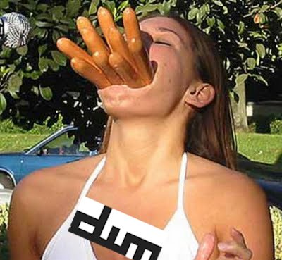

# Dynamic, Command-Line Driven Window Swallowing for dwm

This patch introduces dynamic window swallowing to dwm. Any window may be
either queued to swallow a future window based on the latter's class name,
instance name and window title or may perform an immediate swallow of any other
existing window. Swallowing is controlled on a per-window basis, may be stopped
at any time and may be nested to arbitrary depth. A command-line tool is
included to facilitate scripting.

## 1. Introduction & Usage

As an introduction to window swallowing and an overview of the patch's capabilities watch this screen cast:

<p align="center">
	<a href="https://www.youtube.com/watch?v=iB4aBY0H_oI">
		
	</a>
	<br>
	<a href="https://www.youtube.com/watch?v=iB4aBY0H_oI">https://www.youtube.com/watch?v=iB4aBY0H_oI</a>
</p>

### 1.1 Queing Swallowing of Future Windows

Any window managed by dwm may be targeted to swallow any upcoming window whose
attributes match the class name, instance name and window title filters using
the command-line tool `dwmswallow`. Quoting from `dwmswallow --help`:

```
dwmswallow SWALLOWER [-c CLASS] [-i INSTANCE] [-t TITLE]
  Queue window SWALLOWER to swallow the next about-to-be-mapped window whose
  attributes match the CLASS name, INSTANCE name and window TITLE filters
  using basic string-matching. An omitted filter will match anything.
```

The next window whose filters match will be swallowed by SWALLOWER, taking its
place. See the following example in which a terminal launches a PDF viewer and
swallows its window, essentially creating the impression of PDF previews inside
the terminal. Upon closing the PDF the terminal reappears. Note the symbol
being drawn next to the layout symbol while the swallow is active.


NOTE: This example uses the WINDOWID envvar to retrieve the terminal's window
id. Some terminals such as `st` or `kitty` export the variable, while others
such as `gnome-terminal` don't.

Swallowing is not restricted to terminals and any two windows may be involved.
Firefox may swallow your PDF viewer which may then swallow a terminal itself,
if you fancy that sort of thing. An uninhibited orgy, free and open-source.

### 1.2 Swallowing of Existing Windows

Swallowing of existing windows may be done either from the command-line (see
`dwmswallow --help`) or using drag-and-drop via pointer (*mod+shift+button1* by
default).

See the following example in which a terminal is used to launch an application
whose stdout is considered important during its startup sequence. Once the
startup finishes without errors the stdout is of no interest and the terminal
window is made to swallow the application window by drag-and-dropping the
latter onto the former.


Afterwards, the terminal can be remapped at any time by stopping the swallow using
the hotkey *mod+u*, which is not shown in the gif.

## 2. Patching Instructions

This patch is a diff against dwm's latest commit at the time of this writing
(61bb8b2) and is meant to be self-contained. Unless you're using unmodified dwm
the adaptions to the patch listed below may be necessary or appropriate to
better fit in with your existing build.

### 2.1 Patch-Specific Geometry Parameters

When swallowing a window the swallowee copies the swallower's geometry
parameters to reposition itself to where the swallower used to be, creating the
impression of one window incorporating another. There exist patches which add
client-specific parameters which can modify a window's size or behavior. When
applying the dynamicswallow patch these parameters must be configured manually
in two places:

1. Inside `swal()`: during the swallowing of a window the swallowee shall
   inherit a copy of the swallower's values of these parameters.
2. Inside `swalstop()`: when swallowing is stopped the swallower is remapped
   and the parameters' defaults for its window have to be chosen.

As a representative example consider the
[cfacts](https://dwm.suckless.org/patches/cfacts/) patch which allows to
configure the relative sizes of the windows when in tiling mode using the
client-specific parameter `cfact` of type float. The two changes necessary to
accommodate this parameter are:

1. Inside `swal()`: `cfact` shall be copied from the swallower to the swallowee.

    ```c
    /* Configure geometry params obtained from patches (e.g. cfacts) here. */
    swee->cfact = swer->cfact;
    ```

2. Inside `swalstop()`: the swallower's `cfact` shall be set to a sensible default.

    ```c
    /* Configure geometry params obtained from patches (e.g. cfacts) here. */
    swer->cfact = 1.0;
    ```

The specific places of where to configure the parameters are marked with
comments included in the patch.

### 2.2 Inter-Process Communication

In order for `dwmswallow` to communicate with dwm some means of inter-process
communication is required which dwm does not provide by default. To this end,
this patch includes an adaption of the
[fakesignal](https://dwm.suckless.org/patches/fsignal/) patch which allows
sending commands to dwm by concatenating the command and its parameters into a
string using a specific format and setting the name of the root window to this
string.

The fakesignal patch is lightweight, non-intrusive, easy to use and easy to
extend to other commands. If your build does not include any IPC mechanisms
there's no reason to not use fakesignal as a starting point. Its only downside
is that the communication is unidirectional: one may send commands to dwm but
dwm cannot send a reply in return.

If your build of dwm does contain an IPC mechanism you may, of course, use the
existing communication pathways. While there's nothing wrong with using
fakesignal to try out the patch you will eventually want to seemlessly
integrate everything into your existing build. To recreate the functionality of
the vanilla version of this patch you'll have to

1. relay the execution of `dwmswallow SWALLOWER SWALLOWEE` to a call to `swal()`
2. relay the execution of `dwmswallow -c CLASS -i INSTANCE -t TITLE` to a call to `swaladdpool()`.

using your IPC mechanism of choice.

## 3. Assorted Notes and Implementation Details

Here's a collection of notes which may act as an aid to understanding the
internals of the patch. Consult if you're interested in manipulating the
patch's default behavior.

### 3.1 Swallow Indicator in Status Bar

If the currently selected window on a monitor is being swallowed a
tongue-symbol 👅 (U+1F445) is drawn on the status bar next to the layout
symbol. If this is undesired remove the relevant commented section from
`drawbar()` or change the symbol in your *config.h*.

### 3.2 Retroactive Swallowing

When queueing swallowing of a future window involving the window's title as a
filter the swallowing may fail for some applications if retroactive swallowing
is disabled (set by `swalretroactive`). This is due to the fact these
applications create their window using a default window title and only update
it later to the proper, usage-specific value. When dwm checks whether any
queued swallows match the window's title it finds that none do due to the usage
of the default window title when the window is mapped.

If retroactive swallowing is enabled anytime a window changes its title dwm
checks whether any queued swallow matches the window and executes it
accordingly. If you find yourself wanting to filter by window title keep
retroactive swallowing enabled. While things are small, as they usually are,
the runtime costs are completely negligible.

An example of this is the PDF viewer zathura. Zathura's window title reflects
the currently viewed file and may be used to queue swallows of PDF previews
filtered by filename. However, zathura's startup sequence exhibits the above
behavior and the window title is set to reflect the filename only after a
default window title has been used.

```
# This requires retroactive swallowing
dwmswallow $WINDOWID -c Zathura -t ~/books/xlib.pdf
zathura ~/books/xlib.pdf
```

### 3.3 Decaying of Queued Swallows

It occasionally happens that swallows are queued but not consumed, either due
to misspelling the filters, causing them to never match or because the user's
intention has changed along the way. If `swaldecay` is set to a value greater
than zero any queued swallow is removed if it hasn't been consumed after so
many new windows are mapped, i.e. after *swaldecay* unsuccessful matches.

<!--
TODO: readme: Stopping Swallows, Destruction of Swallowers
TODO: readme: Swallowing respects size hints
FIX: A killed swee's swer gets restored in tiling mode
TODO: Implement a way to remove queued swallows
	as a cleanup: dwmswallow $WINDOWID; echo lol; dwmswallow $WINDOWID -r
-->
