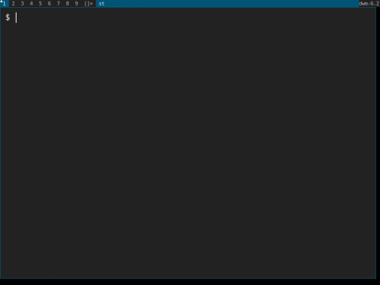

# Dynamic and command-line driven window swallowing for dwm

This patch introduces dynamic window swallowing to dwm. Any window may be
either queued to swallow a future window based on the latter's class name,
instance name and window title or may perform an immediate swallow of any other
existing window. Swallowing is controlled on a per-window basis, may be stopped
at any time and may be nested to arbitrary depth. A command-line tool is
included to facilitate scripting.

## 1. Introduction & Usage

// TODO: Basic idea and nomenclature

### 1.1 Queing Swallows of Future Windows

Any window managed by dwm may be targeted to swallow any upcoming window whose
attributes match the class name, instance name and window title filters using
the command-line tool `dwmswallow`. Quoting from `dwmswallow --help`:

```
dwmswallow SWALLOWER [-c CLASS] [-i INSTANCE] [-t TITLE]
  Queue window SWALLOWER to swallow the next about-to-be-mapped window whose
  attributes match the CLASS name, INSTANCE name and window TITLE filters
  using basic string-matching. An omitted filter will match anything.
```

The next window whose filters match will be swallowed by SWALLOWER, taking its
place. See the following example in which a terminal launches a PDF viewer and
swallows its window, essentially creating the impression of PDF previews inside
the terminal. Upon closing the PDF the terminal reappears. Note the symbol
being drawn next to the layout symbol while the swallow is active.


NOTE: This example uses the WINDOWID envvar to retrieve the terminal's window
id. Some terminals such as `st` or `kitty` export the variable, while others
such as `gnome-terminal` don't.

Swallowing is not restricted to terminals and any two windows may be involved.
Firefox may swallow your PDF viewer which may then swallow a terminal itself,
if you fancy that sort of thing. An uninhibited orgy, free and open-source.

### 1.2 Swallow Control During Runtime

Swallowing of existing windows may be done either from the command-line (see
`dwmswallow --help`) or using drag-and-drop via pointer (*mod+shift+button1* by
default).

See the following example in which a terminal is used to launch an application
whose stdout is considered important during its startup sequence. Once the
startup finishes without errors the stdout is of no interest and the terminal
window is made to swallow the application window by drag-and-dropping the
latter onto the former.



The terminal could have been remapped at anytime by stopping the swallow using
the hotkey *mod+u*, which is not shown in the gif.

### 1.3 Stopping Swallows, Destruction of Swallowers

TODO

## Details

TODO:
- Basic implementation scheme
- Legibility, maintainability, conciseness over performance and an extra
  roundtrip here and there until feedback is gathered; premature optimization
- Optimization